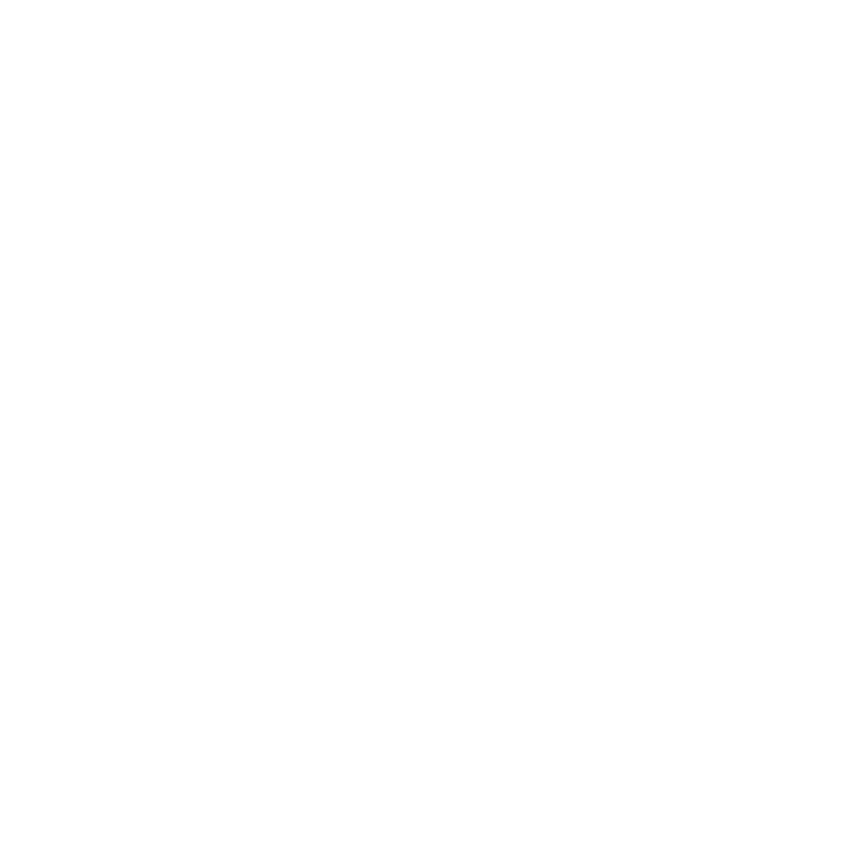

[](https://nodejs.org)
[](https://apps.developer.athom.com)
[](https://apps.developer.athom.com)

# HomeyMatter Link

HomeyMatter Link is a powerful bridge designed to enable seamless integration between Homey devices and the Matter protocol. This bridge allows your smart devices managed through Homey to be exposed and compatible with the Matter ecosystem, providing enhanced interoperability and a unified smart home experience. Whether you're aiming to expand your device compatibility or streamline your smart home setup, HomeyMatter Link ensures effortless connectivity and operation.

## Setup & Usage 🛠️

To set up and use HomeyMatter Link, follow these steps:

1. **Download the Latest UI Release**:
   Retrieve the latest UI release from the [GitHub Releases Page](https://github.com/rcaceiro/eu.rcaceiro.homey.matterbridge/releases/latest):

   ```bash
   curl -L -o ui_release.zip https://github.com/rcaceiro/eu.rcaceiro.homey.matterbridge/releases/latest
   unzip ui_release.zip -d ./settings
   ```
   
2. **Run the Homey App**: 
   Execute the following command to run the application locally:

   ```bash
   homey app run -n host
   ```

   Ensure the extracted files are placed into the `settings` folder of your project directory.

Make sure you have the necessary prerequisites installed, including the Homey CLI and Node.js 18+.

## UI Integration 🚀

The User Interface for this project is managed by a separate repository, built using Kotlin Multiplatform (WASM). You can find the UI project here:

[HomeyMatter UI Repository](https://github.com/rcaceiro/eu.rcaceiro.homey.matterbridge.ui)

## Community 💬

Join the discussion and find support here:

- [GitHub Issues](https://github.com/rcaceiro/eu.rcaceiro.homey.matterbridge/issues)
- [Homey Community Forum](https://community.homey.app/t/app-homeymatter-link/125841)

## Future Plans 🌟

- Enhanced support for additional Homey devices.
- Help figure it out.

---

Thank you for using HomeyMatter Link! For more details or inquiries, feel free to explore the [Homey App Store](https://apps.developer.athom.com) or reach out through the community forums.
